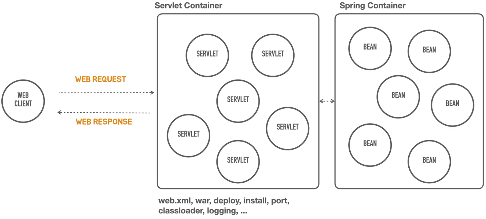

## Containerless

컨테이너 웹 애플리케이션 아키텍쳐

### Container

Web Container(Java: Servlet Conatiner) -> Web Component를 관리 -> life cycle 관리

Web Component(Java: Servlet) -> Dynamic Content를 만듦

Web Client -> Web Request


  

```java
// factory 생성
ServletWebServerFactory serverFactory = new TomcatServletWebServerFactory();
// webserver
WebServer webServer = serverFactory.getWebServer();
// server 실행
webServer.start();
```