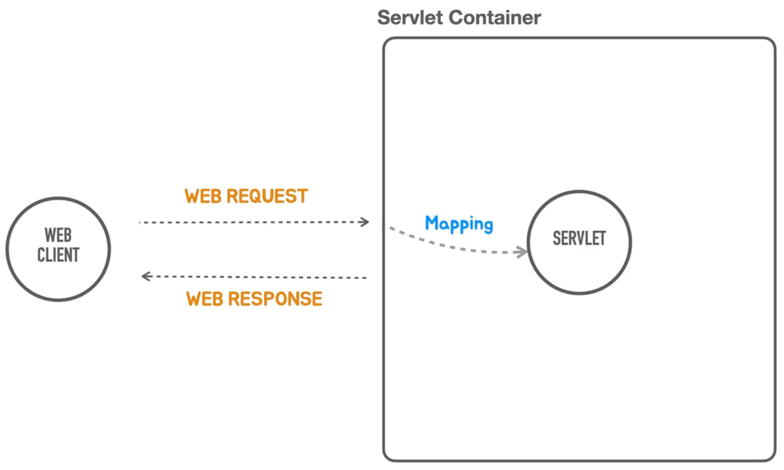

## servlet




```java
// server
WebServer webServer = serverFactory.getWebServer(servletContext ->
        // add servlet
        servletContext.addServlet("hello", new HttpServlet() {
            @Override
            protected void service(HttpServletRequest req, HttpServletResponse resp) throws ServletException, IOException {
                resp.setStatus(200);
                resp.setHeader("Content-Type", "text/plain");
                resp.getWriter().println("Hello Servlet");
                resp.getWriter().println("Nice to meet you");
            }
        }).addMapping("/hello")
);
```